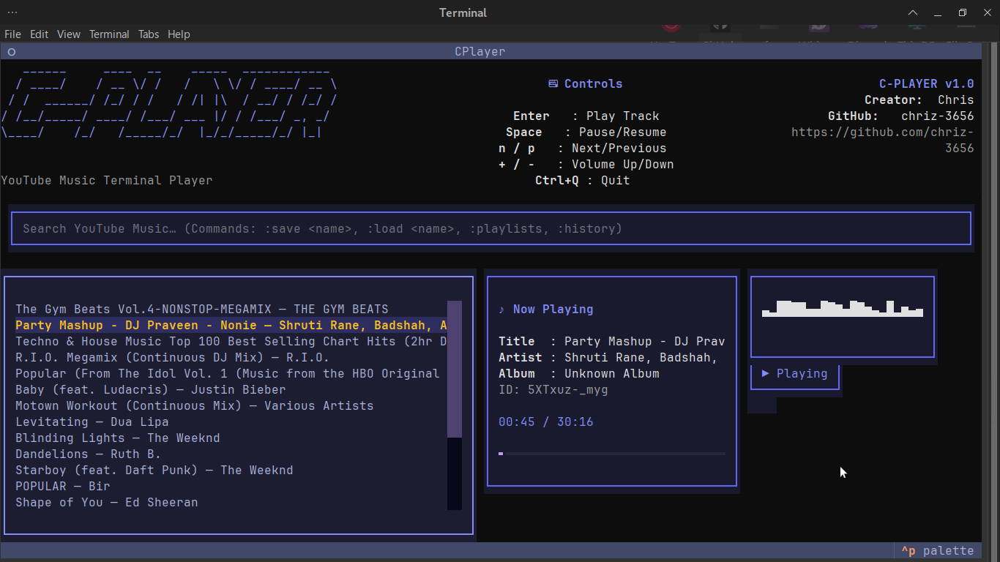

# 🎵 C-PLAYER — Terminal YouTube Music Player

C-PLAYER is a **high-performance Terminal User Interface (TUI) music player** built with **Python** that allows you to search and stream music directly from **YouTube Music** inside your terminal.

It is designed to be **lightweight, fast, keyboard-driven**, and ideal for Linux users who prefer a clean CLI/TUI workflow over heavy GUI applications.

---

## ✨ Features

* 🔍 Search songs directly from **YouTube Music**
* 🎧 High-quality audio playback via **mpv**
* ⌨️ Fully keyboard-driven interface
* 📊 Real-time progress bar & metadata display
* 🎶 Lightweight terminal audio visualizer
* ⚡ Minimal CPU & RAM usage
* 🧩 Modular and extensible architecture

---

## 🖼️ Preview

> 📌 Screenshot of C-PLAYER running inside a terminal



> 📌 demo VIDEO


---

## 🎯 Project Goals

* Provide a **zero-GUI** music streaming experience
* Avoid browsers and heavy desktop apps
* Offer a **modern TUI** with clean visuals
* Maintain **low resource usage** on older systems
* Keep the codebase **clean, modular, and hackable**

---

## 🏗️ Architecture Overview

C-PLAYER follows a clean, layered design separating UI, logic, and services.

### 🔹 Entry Point

* **`app/main.py`**

  * Application bootstrap
  * Manages Textual UI lifecycle
  * Handles global key bindings

### 🔹 Controller Layer (`app/controller/`)

* **`player.py`**

  * Manages `mpv` playback
  * Communicates via Unix IPC socket (`/tmp/cplayer.sock`)
  * Handles pause, volume, seek, progress updates

* **`queue.py`**

  * Track queue and navigation logic

### 🔹 Service Layer (`app/services/`)

* **`ytmusic.py`** — YouTube Music search using `ytmusicapi`
* **`resolver.py`** — Audio stream resolution using `yt-dlp`

### 🔹 UI Layer (`app/ui/`)

* **`banner.py`** — ASCII logo & control hints
* **`panels.py`** — Now Playing metadata & progress bar
* **`visualizer.py`** — Terminal-based visualizer

---

## 📁 Project Structure

```
C-player
├── app
│   ├── controller
│   │   ├── player.py
│   │   └── queue.py
│   ├── services
│   │   ├── ytmusic.py
│   │   └── resolver.py
│   ├── ui
│   │   ├── banner.py
│   │   ├── panels.py
│   │   └── visualizer.py
│   └── main.py
├── requirements.txt
├── run.sh
├── LICENSE
└── README.md
```

---

## 🛠️ Requirements

### System Requirements

* Linux (recommended)
* Python **3.9+**
* `mpv` media player

### Python Dependencies

* textual
* yt-dlp
* ytmusicapi
* pyfiglet

---

## 📦 Installation

### 1️⃣ Install System Dependencies

```bash
sudo apt install mpv python3 python3-pip
```

---

### 2️⃣ Clone the Repository

```bash
git clone https://github.com/chriz-3656/C-player.git
cd C-player
```

---

### 3️⃣ Install Python Dependencies

```bash
pip install -r requirements.txt
```

---

### 4️⃣ Make the Run Script Executable

```bash
chmod +x run.sh
```

---

### 5️⃣ Run C-PLAYER

```bash
./run.sh
```

---

## ⌨️ Keyboard Controls

| Key      | Action              |
| -------- | ------------------- |
| Enter    | Play selected track |
| Space    | Pause / Resume      |
| N        | Next track          |
| P        | Previous track      |
| +        | Volume up           |
| -        | Volume down         |
| Ctrl + Q | Exit application    |

---

## 🚀 How It Works (Execution Flow)

1. User types a search query
2. `ytmusicapi` fetches results from YouTube Music
3. Selected track ID is resolved via `yt-dlp`
4. Direct audio stream URL is passed to `mpv`
5. `mpv` playback is controlled via IPC
6. UI updates metadata and progress in real time

---

## 🧠 Extensibility Ideas

* Playlist support
* Offline caching
* Theme switching
* Plugin system
* Spotify / SoundCloud support
* Packaging as `.deb` / AppImage / pip package

---

## ⚠️ Disclaimer

C-PLAYER streams content from YouTube Music using public tools. This project is intended for **educational and personal use only**. Users are responsible for complying with YouTube’s terms of service.

---

## 📜 License (MIT)

```
MIT License

Copyright (c) 2026 Chris

Permission is hereby granted, free of charge, to any person obtaining a copy
of this software and associated documentation files (the "Software"), to deal
in the Software without restriction, including without limitation the rights
to use, copy, modify, merge, publish, distribute, sublicense, and/or sell
copies of the Software, and to permit persons to whom the Software is
furnished to do so, subject to the following conditions:

The above copyright notice and this permission notice shall be included in all
copies or substantial portions of the Software.

THE SOFTWARE IS PROVIDED "AS IS", WITHOUT WARRANTY OF ANY KIND, EXPRESS OR
IMPLIED, INCLUDING BUT NOT LIMITED TO THE WARRANTIES OF MERCHANTABILITY,
FITNESS FOR A PARTICULAR PURPOSE AND NONINFRINGEMENT. IN NO EVENT SHALL THE
AUTHORS OR COPYRIGHT HOLDERS BE LIABLE FOR ANY CLAIM, DAMAGES OR OTHER
LIABILITY, WHETHER IN AN ACTION OF CONTRACT, TORT OR OTHERWISE, ARISING FROM,
OUT OF OR IN CONNECTION WITH THE SOFTWARE OR THE USE OR OTHER DEALINGS IN THE
SOFTWARE.
```

---

## 👤 Author

**Chris**
GitHub: [https://github.com/chriz-3656](https://github.com/chriz-3656)

---

⭐ If you like this project, consider starring the repository!
